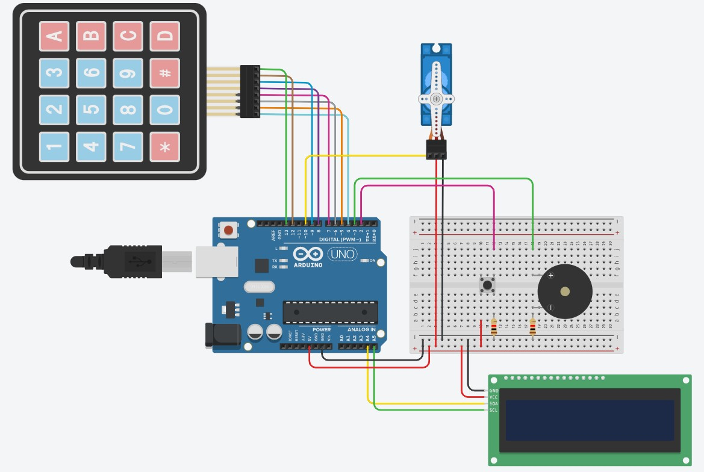
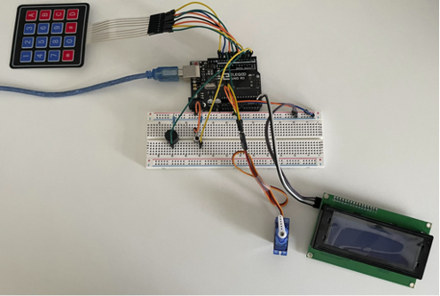
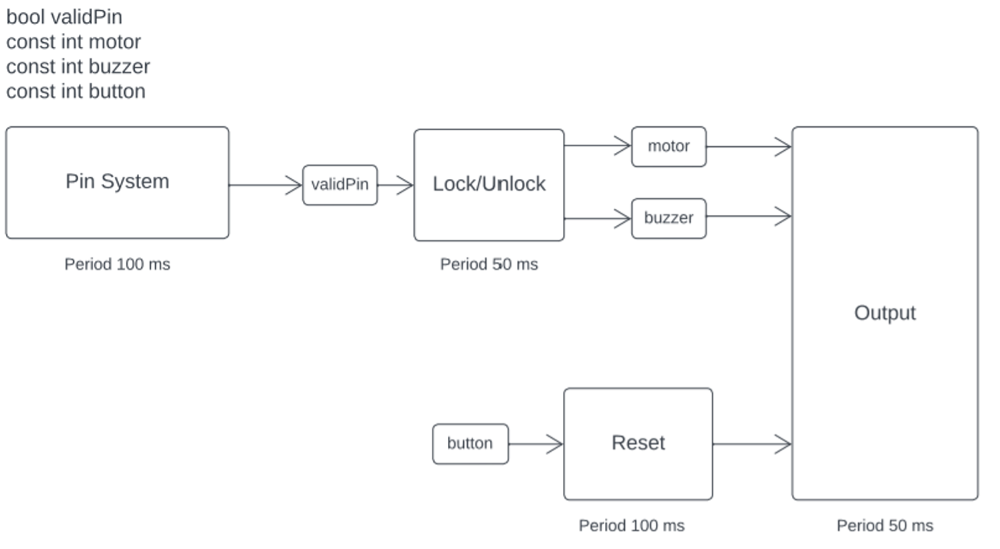
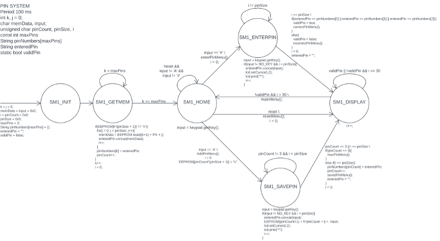
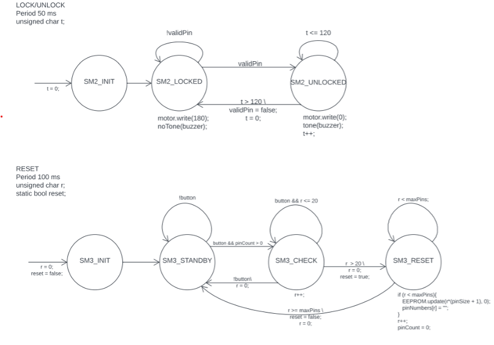

# SMART LOCK
[YouTube Demo](https://youtu.be/Yundt-XGh0U)

## Introduction
The smart lock is a keyless entry system. It has a display that shows the status of the door and menu. The user can unlock the system with a chosen 5-Digit PIN. When it unlocked, the user hears a buzzer for 15 seconds (while it remains unlocked) and then they system locks automatically. The user can create up to 3 PINs and can use the reset button to erase all previous PINs.

## User Guide
The user selects an option from the Home Screen using the keypad. 

If selection ‘A’ is chosen, then they are prompted to enter a new 5-Digit PIN that is saved. They can store up to 3 PINs. If they want to clear all PINs saved, they must push the reset button for 2 seconds. The system will let them know that there are no PINs saved.

If selection ‘#’ is chosen, they are prompted to enter a saved PIN to unlock the door. If PIN is valid the buzzer will sound, and the door will unlock. If PIN is invalid, a message showing the PIN is incorrect will show and it will go back to the home screen. 

## Complexities
- Keypad to enter PIN and select menu options
- Servo Motor to unlock and lock
- EEPROM to memorize multiple PINs

## Hardware Components
- Computing
    - Elegoo UNO R3
- Inputs
    - 4x4 Keypad
    - Button
- Outputs
    - 20x4 LCD Screen 
    - Servo Motor
    - Buzzer

## Software Libraries Used
- Servo.h: Used to change the motor’s shaft angle to open/close lock
- Keypad.h: Used to get keys that are being pushed by user and mapped to array of each key.
- LiquidCrystal_I2C.h: Used to write the user menus to the 20x4 LCD Screen.
- EEPROM.h: Used to read/write the PINs stored on the ATMEGA328P

## Diagrams 
---

### Wiring Diagram

### Task Diagram

###  SynchSM Diagram

